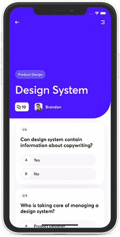
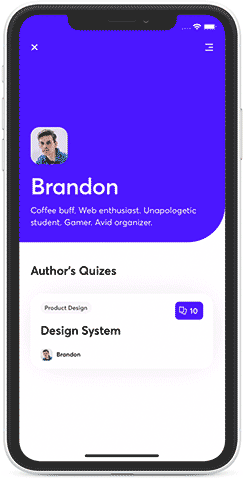

<div align="center">
  <image align="center" src="./assets/readme_header.svg"/>
</div>
<div align="center">
  <h1>Stickyheader.js</h1>
</div>

<div align="center">
  <image src="https://app.bitrise.io/app/1ffc1637c8691f4f/status.svg?token=2vMEootz4cobIHmtr5UeYg&branch=develop"/>
  <image src="https://badge.fury.io/js/react-native-sticky-parallax-header.svg"/>
  <image src="https://img.shields.io/npm/dt/react-native-sticky-parallax-header"/>
</div>
<div align="center">
    <br/><em>Brought with</em> &nbsp;❤️ <em>by</em> &nbsp; <a href="https://www.netguru.com">
        
      </a>
</div>


# Introduction

<p align="center">
  Stickyheader.js is a simple React Native library, enabling to create a fully custom header for your iOS and Android apps.
</p>

<div align="center">
  <a href="#Preview">Preview</a> &nbsp;|&nbsp; <a href="#Getting-Started">Getting Started</a> &nbsp;|&nbsp; <a href="#Contributing">Contributing</a> &nbsp;|&nbsp; <a href="#Contributors">Contributors</a>
</div>


<h1 id="Preview">Preview</h1>
<h2> Features </h2>
Stickyheader.js ships with 3 different use cases for sticky headers and a possibility to create fully custom header!

| Tabbed Header | Avatar Header | Details Header|
| :------: | :------: | :------: |
|  || |


## In Use

**Check the live demo on Expo Snack [here](https://snack.expo.io/@maciejbudzinsking/sticky-parallax-header-by-netguru).**

Predefined headers can be accessed through `headerType="HeaderName"` property, each header can be configured according to your demands using the wide amount of properties. You can change all of them, or use it right out of the box with as little changes as possible to use it for your needs

This is how you can add them in your app:

```jsx
import React from 'react'
import StickyParallaxHeader from 'react-native-sticky-parallax-header'

const TestScreen = () => (
  <>
    <StickyParallaxHeader headerType="TabbedHeader" />
    {/* <StickyParallaxHeader headerType="AvatarHeader" /> */}
    {/* <StickyParallaxHeader headerType="DetailsHeader" /> */}
  </>
)

export default TestScreen
```


Below are examples of those components and description of the props they are accepting.

## Shared props

### Tabbed Header, Details Header, Avatar Header

| Property                      | Type                                                  | Optional |  Default                                                                                                                                                                                       | Description                                              |
| :---------------------------: | :---------------------------------------------------: | :-------:| :--------------------------------------------------------------------------------------------------------------------------------------------------------------------------------------------: | :-------------------------------------------------------:|
| `backgroundColor`             | `string`                                              |    Yes   | `#1ca75d`                                                                                                                                                                                      | Header background color                                  |
| `backgroundImage`             | `number`                                              |    Yes   | `null`                                                                                                                                                                                         | Sets header background image                             |
| `bounces`                     | `bool`                                                |    Yes   | `true`                                                                                                                                                                                         | Bounces on swiping up                                    |
| `contentContainerStyles`                  | `View.propTypes.style`                                 |    Yes   |                                                                                                                                                                                                | Set style for content container                         |
| `headerHeight`                | `number`                                              |    Yes   | `ifIphoneX(92, constants.responsiveHeight(13))`                                                                                                                                                |
| `DEPRECATED_renderBody` | `func` | Yes | `title => <RenderContent title={title} />` | Function that renders body of the header (can be empty). Deprecated: use `children` instead |
| `children` | `ReactElement` | Yes | `<RenderContent />` | Renders body of header (can be empty). Replaces `renderBody`  |
| `snapToEdge`                  | `bool`                                                |    Yes   | `true`                                                                                                                                                                                         | Boolean to fire the function for snap To Edge            |
| `scrollRef`                   | `func or object`                                      |    Yes   | `null`                                                                                                                                                                                         | ScrollView body ref. Allows programmatically scroll body [ScrollView](https://reactnative.dev/docs/scrollview#methods)           |
| `keyboardShouldPersistTaps`   | `'always', 'never', 'handled', false, true`           |    Yes   | `undefined`                                                                                                                                                                                    | Determines when the keyboard should stay visible after a tap.|
| `refreshControl`              | `RefreshControl`           |    Yes   | `undefined`                                                                                                                                                                                    | Props used to add pull to refresh functionality.|
|     `decelerationRate`      |             `number or string`              |   Yes    |                    `"fast"`                     |                                     Set the deceleration rate for the ScrollView. 
| `parallaxHeight`      | `number`                                                   |    No    | -                                                                            | Set parallax header height                               |
| `foreground`          | `() => ReactElement`                                       |    No    | -                                                                            | Function that renders the foreground of the header       |
| `headerSize`          | `func`                                                     |    Yes   | -                                                                            | Get current size of header                               |

### Details Header, Avatar Header

| Property                      | Type                                                  | Optional |  Default                                                                                                                                                                                       | Description                                              |
| :---------------------------: | :---------------------------------------------------: | :-------:| :--------------------------------------------------------------------------------------------------------------------------------------------------------------------------------------------: | :-------------------------------------------------------:|
 | `hasBorderRadius`     | `boolean`                         |    No    | `true`                                                                       | Adds radius to header's right bottom border               |
 | `image`               | `ImageSourcePropType`                                      |    No    | `require('../../assets/images/photosPortraitBrandon.png')`                   | Sets header image                                        |
 | `leftTopIcon`         | `ImageSourcePropType`             |    No    | `require('../../assets/icons/iconCloseWhite.png')`                           | Set icon for left top button                             |
 | `leftTopIconOnPress`  | `() => void`                      |    No    | `() => {}`                                                                   | Define action on left top button press                   |
 | `rightTopIcon`        | `ImageSourcePropType`                                      |    No    | `require('../../assets/icons/Icon-Menu.png') `                               | Set icon for right top button                            |
 | `rightTopIconOnPress` | `() => void`                      |    No    | `() => {}`                                                                   | Define action on right top button press                  |

## Tabbed Header


| Property                      | Type                                                  | Optional |  Default                                                                                                                                                                                       | Description                                              |
| :---------------------------: | :---------------------------------------------------: | :-------:| :--------------------------------------------------------------------------------------------------------------------------------------------------------------------------------------------: | :-------------------------------------------------------:|
 | `foregroundImage`             |`oneOfType([object, number])`                          |    Yes   |                                                                                                                                                                                                | Set image in the foreground                              |
| `header`                      |`func`                                                 |    Yes   |                                                                                                                                                                                                | Function that renders custom header                       |
| `logo`                        | `func`                                                |    Yes   | `require('../../assets/images/logo.png')`                                                                                                                                                      | Set header logo                                          |
| `logoStyle`                   | `style`                                               |    Yes   | `{ height: 24, width: 142 }`                                                                                                                                                                   | Set header logo style                                    |
| `logoContainerStyle`          | `style`                                               |    Yes   | `{    width: '100%', paddingHorizontal: 24, paddingTop: Platform.select({ ios: ifIphoneX(50, 40), android: 55 }), flexDirection: 'row', justifyContent: 'space-between', alignItems: 'center'}`| Set header logo container style                          |
| `logoResizeMode`              | `"contain", "cover", "stretch", "center", "repeat" `  |    Yes   | `"contain"`                                                                                                                                                                                    | Set header logo resize mode                              |
| `onRef`                 |`func`                                                 |    Yes   |                                                                                                                                                                                                | Reference callback. You can call goToPage(pageNumber) method through ref to programmatically navigate to given tab                |
| `rememberTabScrollPosition`   |`bool`                                                 |    Yes   |`false`                                                                                                                                                                                         | When switching between tabs remember current scroll position                        |
| `scrollEvent`                 |`func`                                                 |    Yes   |                                                                                                                                                                                                | Scroll event to apply custom animations                  |
| `tabs`                        |`{ content: ReactElement;title?: string;icon?: ReactElement` &#124; `(isActive: boolean) => ReactElement);`                                |    Yes   | `[{title: 'Popular',content: <RenderContent title="Popular Quizes" />},...]`                                                                                                                   | Array with tabs names, icons and content                        |
| `tabTextStyle`                |`Text.propTypes.style`                                 |    Yes   |`{fontSize: 16, lineHeight: 20, paddingHorizontal: 12, paddingVertical: 8, color: colors.white}`                                                                                                | Set inactive tab style                                   |
| `tabTextActiveStyle`          |`Text.propTypes.style`                                 |    Yes   |`{fontSize: 16, lineHeight: 20, paddingHorizontal: 12, paddingVertical: 8, color: colors.white}`                                                                                                | Set active tab stylee                                    |
| `tabTextContainerStyle`       |`ViewPropTypes.style`                                  |    Yes   |`{backgroundColor: colors.transparent, borderRadius: 18}`                                                                                                                                       | Set inactive tab container style                         |
| `tabTextContainerActiveStyle` |`ViewPropTypes.style`                                  |    Yes   |`{backgroundColor: colors.darkMint}`                                                                                                                                                            | Set active tab container style                           |
| `tabWrapperStyle`             |`ViewPropTypes.style`                                  |    Yes   |`{paddingVertical: 12}`                                                                                                                                                                         | Set single tab container style                           |
| `tabsContainerStyle`          |`ViewPropTypes.style`                                  |    Yes   |                                                                                                                                                                                                | Set whole tab bar container style                        |
| `title`                       | `string`                                              |    Yes   | `"Mornin' Mark! \nReady for a quiz?"`                                                                                                                                                          | Sets header title                                        |
| `titleStyle`                  |`Text.propTypes.style`                                 |    Yes   |                                                                                                                                                                                                | Set style for text in foreground                         |

[Check how to customise Tabbed Header example](docs/TABBEDHEADER.MD)

## Details Header



| Property              | Type                              | Required |  Default                                                                     | Description                                              |
| :-------------------: | :--------------------------------:| :-------:| :---------------------------------------------------------------------------:| :-------------------------------------------------------:|
 | `iconNumber`          | `number`                          |    No    | `10`                                                                         | Set amount of cards shown on icon                        |
| `tag`                 | `string`                          |    No    | `"Product Designer"`                                                         | Sets header tag name                                     |
| `title`               | `string`                          |    No    | `"Design System"`                                                            | Sets header title                                        |
| `transparentHeader`   | `boolean`                                                  |    No    | `false`                                                                      | Set header transparency to render custom header          |


## Avatar Header



| Property              | Type                                                       | Optional |  Default                                                                     | Description                                              |
| :-------------------: | :---------------------------------------------------------:| :-------:| :---------------------------------------------------------------------------:| :-------------------------------------------------------:|
| `header`              | `() => ReactElement`                                       |    No    | -                                                                            | Function that renders custom header                      |
 | `scrollEvent`         | `(event: NativeSyntheticEvent<NativeScrollEvent>) => void` |    No    | `require('../../assets/icons/Icon-Menu.png') `                               | Scroll event to apply custom animations                  |
| `snapStartThreshold`  | `number`                                                   |    No    | -                                                                            | Set start value Threshold of snap                        |
 | `snapStopThreshold`   | `number`                                                   |    No    | -                                                                            | Set stop value Threshold of snap                         |
| `snapValue`           | `number`                                                   |    No    | -                                                                            | Set value where header is closed                         |
| `subtitle`            | `string`                                                   |    No    | `"Coffee buff. Web enthusiast. Unapologetic student. Gamer. Avid organizer."`| Sets description(subtitle) section                       |
| `title`               | `string`                                                   |    No    | `"Brandon`                                                                   | Sets header title                                        |
| `transparentHeader`   | `boolean`                                                  |    No    | `false`                                                                      | Set header transparency to render custom header          |

## Custom Header

[Custom header props and example](docs/CUSTOM.md)

## Handling StickyParallaxHeader body ScrollView reference
### As callback function
```
<StickyParallaxHeader
  scrollRef={(ref) => {
    paralaxScrollRef.current = ref;
  }}
  foreground={this.renderForeground()}
  header={this.renderHeader()}
>
  {renderBody()}
</StickyParallaxHeader>
```

### As useRef value
```
const paralaxScrollRef = useRef(null);

<StickyParallaxHeader
  scrollRef={paralaxScrollRef}
  foreground={this.renderForeground()}
  header={this.renderHeader()}
>
  {renderBody()}
</StickyParallaxHeader>
```


## Handling nested scrollables

[Handling nested flatlist props and example](docs/CUSTOM.md#Tips)
## Changing Statusbar style

[Changing StatusBar style](docs/CUSTOM.md#changing-statusbar-style)

## Pull to refresh

[Pull to refresh](docs/CUSTOM.md#Pull-to-Refresh)

## Rendering icons in tabs

[Icons in tabs](docs/CUSTOM.md#Icons-in-tabs)


<h1 id="Getting-Started">Getting Started</h1>

## Prerequisites
* [React Native](https://facebook.github.io/react-native/docs/getting-started.html)
* [Yarn](https://yarnpkg.com/en/docs/install)
* [node v10.9.0](https://github.com/creationix/nvm)

## Installation
### For React Native >= 0.60.0 use version 0.0.60 and above, for previous React Native versions use 0.0.59
### Installation for React Native >= 0.60.0

Add latest package version
```bash
$ yarn add react-native-sticky-parallax-header
```

### Installation for React Native < 0.60.0

[Installation steps for React Native < 0.60.0](docs/INSTALLATION.md)

<h1 id="Contributing">Contributing</h1>

[Contributing guidelines](docs/CONTRIBUTING.md)

<h1 id="Contributors">Contributors</h1>

<div>


<a href="https://github.com/IdaszakDaniel">

</a>


<a href="https://github.com/Karniej">

</a>

<a href="https://www.github.com/kolkol69">

</a>

</div>


# License
The gem is available as open source under the terms of the [MIT License](https://opensource.org/licenses/MIT).
